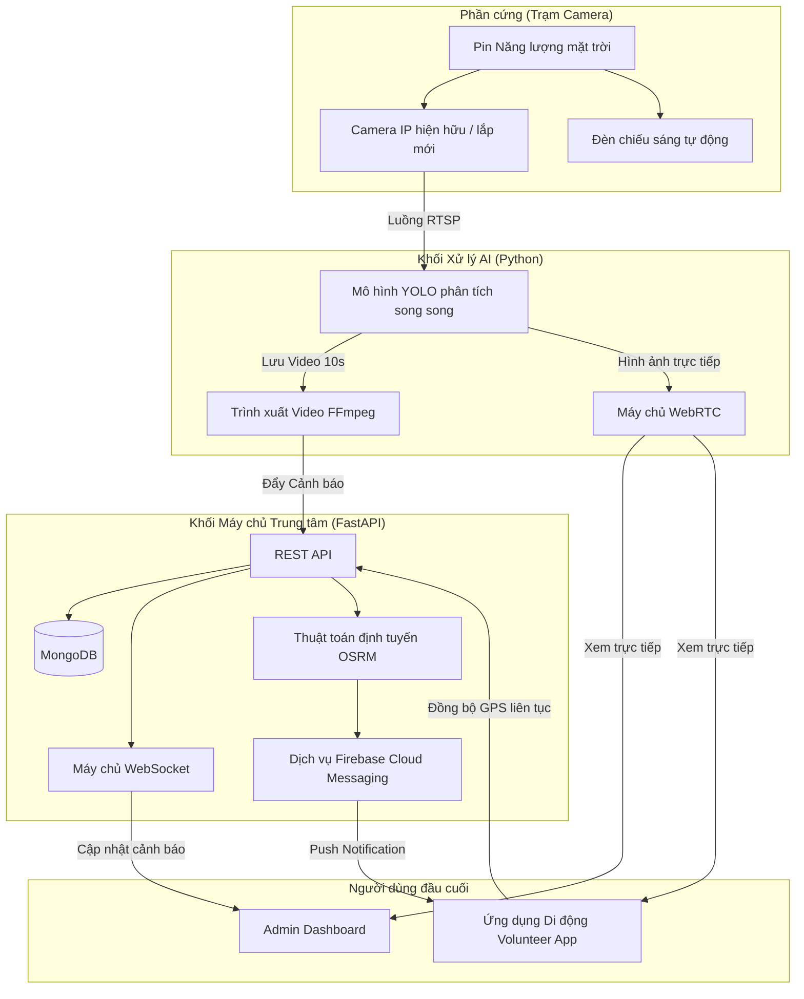
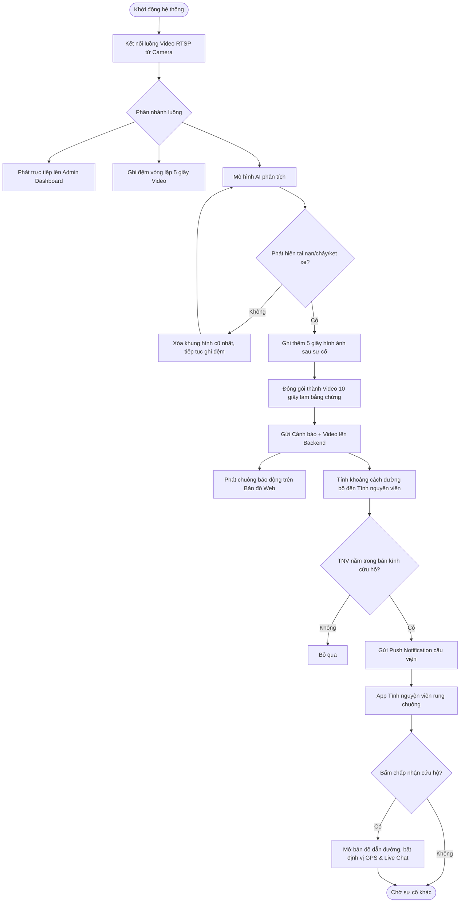

# THUYẾT MINH SẢN PHẨM SÁNG TẠO
*(Dự thi Tin học trẻ - Vòng khu vực)*

---

## ĐĂNG KÝ THÔNG TIN SẢN PHẨM DỰ THI
*[Điền thông tin theo mẫu của Ban tổ chức]*

## THÔNG TIN TÁC GIẢ (NHÓM TÁC GIẢ)
*[Điền thông tin cá nhân/nhóm của bạn]*

---
## GIỚI THIỆU VỀ SẢN PHẨM

### 1. Ý tưởng của sản phẩm
**Lý do lựa chọn nghiên cứu và phát triển sản phẩm**
Từ thực trạng gia tăng phương tiện, áp lực lên hạ tầng giao thông và nguy cơ tai nạn tại nhiều tuyến đường, đặc biệt ở các nút giao có tổ chức giao thông phức tạp, có thể thấy nhu cầu giám sát và cảnh báo sớm rủi ro là yêu cầu vô cùng thiết thực hiện nay. Tuy nhiên, tại các khu vực nông thôn và ngoại ô, công tác giám sát vẫn còn hạn chế do thiếu thiết bị, thiếu hạ tầng kết nối và phụ thuộc vào phương pháp thủ công, dẫn đến khả năng phát hiện tình huống nguy hiểm và phản ứng kịp thời chưa đáp ứng yêu cầu thực tiễn. Trong khi đó, các giải pháp giám sát thông minh tại đô thị lớn tuy đạt hiệu quả cao nhưng thường có chi phí đầu tư – vận hành lớn, yêu cầu hạ tầng đồng bộ và khó mở rộng.

Trong bối cảnh Cách mạng công nghiệp 4.0, công nghệ AI và hệ thống nhúng mở ra hướng tiếp cận khả thi. Việc tích hợp camera và cảm biến trên nền tảng vi điều khiển cho phép thu thập dữ liệu trực tiếp tại hiện trường, xử lý nhanh nhằm nhận diện phương tiện, phát hiện hành vi hoặc tình huống có nguy cơ xảy ra tai nạn. Để tối ưu hóa nguồn lực xã hội, hệ thống còn kết nối trực tiếp với một ứng dụng di động dành cho các tình nguyện viên, tạo thành một mạng lưới phản ứng nhanh tại chỗ.
Với định hướng đó, nhóm quyết định lựa chọn và phát triển sản phẩm: **“Hệ thống giám sát thông minh, cảnh báo sự cố và điều phối cứu hộ giao thông”**.

**Ý nghĩa của sản phẩm**
Từ góc độ nghiên cứu STEM, sản phẩm sáng tạo dành cho học sinh, việc thiết kế một hệ thống nhúng giám sát, điều phối và cảnh báo kịp thời khi tai nạn giao thông xảy ra có ý nghĩa thiết thực. Hệ thống này hướng tới việc phát hiện sớm tai nạn, cảnh báo cho các phương tiện xung quanh, gửi thông tin đến lực lượng chức năng và **điều phối ngay các tình nguyện viên gần nhất** nhằm giảm thiểu hậu quả do tai nạn gây ra. Đồng thời, sản phẩm góp phần làm rõ khả năng ứng dụng hệ thống AI và Cloud trong giải quyết các vấn đề xã hội.

**Mục tiêu sản phẩm**
- *Mục tiêu chung:* Phát triển hệ thống giám sát giao thông thông minh kết hợp ứng dụng di động, dùng camera AI để quan sát, phân tích tình hình giao thông nhằm hỗ trợ cơ quan chức năng, cung cấp bằng chứng và xây dựng hệ thống điều phối cứu hộ chi phí thấp, linh hoạt.
- *Mục tiêu cụ thể:*
  - Thiết kế và chế tạo mô hình giám sát giao thông hoạt động độc lập bằng năng lượng xanh tại các điểm đen giao thông.
  - Cung cấp bằng chứng hình ảnh/video xác thực (lưu vòng lặp 10 giây trước/sau sự cố) cho công tác điều tra xử lý.
  - Phát triển ứng dụng di động để tự động điều phối tình nguyện viên lân cận thông qua thuật toán định tuyến và định vị toàn cầu.

### 2. Giới thiệu tổng quan
**Thực trạng và khoảng trống hiện nay**
Tại Việt Nam, mặc dù số vụ tai nạn có xu hướng giảm, nhưng tỷ lệ tử vong và thương tật vẫn cao. Các biện pháp truyền thống như tuần tra, tuyên truyền tuy có hiệu quả nhất định nhưng còn hạn chế về quy mô, thời gian và chi phí. Hiện nay, các hệ thống camera AI chủ yếu giới hạn ở quy mô lớn, chi phí cao, tối ưu hóa lưu lượng phương tiện là chính. Các giải pháp giao thông thông minh trong nước chưa tích hợp được thiết bị hỗ trợ nhận diện toàn diện (tai nạn, cháy, tụ tập đông người) kết nối trực tiếp với **người tham gia cứu hộ tại hiện trường**.

**Hướng tiếp cận của nhóm**
Trên cơ sở các khoảng trống đã xác định, nhóm lựa chọn hướng tiếp cận theo phương châm lấy sự an toàn và tính mạng con người làm trung tâm, đồng thời phát huy sức mạnh kết nối của cộng đồng. Cụ thể:
- Tăng cường khả năng tương tác giữa người dùng và hệ thống thông qua trang Admin Dashboard và ứng dụng di động Volunteer App.
- Ứng dụng công nghệ IoT, thuật toán Batch Inference và kết nối thời gian thực theo hướng tối ưu, đảm bảo hệ thống hoạt động ổn định 24/7, độ trễ thấp và có khả năng mở rộng.
- Tích hợp các thuật toán bản đồ số để tính toán chính xác lộ trình cầu viện, chủ động phát thông báo khẩn tới thiết bị di động của tình nguyện viên gần nhất.

**Những giải pháp đột phá trong quá trình triển khai:**
Dự án không chỉ tập trung vào kỹ thuật mà còn hướng tới việc giải quyết triệt để các rào cản trong ứng dụng thực tiễn. Dưới đây là những sáng tạo cốt lõi:
- **Xây dựng mạng lưới cứu hộ cộng đồng:** Điểm sáng tạo lớn nhất là không để hệ thống camera chỉ đóng vai trò "người quan sát thụ động". Hệ thống chủ động tìm kiếm và kêu gọi sự giúp đỡ từ những người dùng cài ứng dụng lân cận, biến người dân xung quanh thành lực lượng phản ứng nhanh tại chỗ.
- **Tính toán khoảng cách thông minh:** Nếu chỉ dùng công thức đường chim bay để tìm tình nguyện viên, hệ thống hay báo nhầm người ở gần nhưng bị ngăn cách bởi sông, hồ, đường cao tốc. Nhóm đã tích hợp thuật toán định tuyến đường bộ, giúp việc điều phối cứu hộ cực kỳ chính xác.
- **Lưu trữ bằng chứng hoàn hảo:** Việc phát triển thuật toán ghi đệm vòng lặp giúp hệ thống không bao giờ bỏ lỡ khoảnh khắc xảy ra sự cố, đồng thời đóng gói tự động thành đoạn video 10 giây (trước và sau sự việc) vô cùng hữu ích cho cơ quan điều tra sau này.

---
## MÔ TẢ SẢN PHẨM

### 1. Chức năng chính của sản phẩm
**1.1. Mô tả rõ các tính năng của sản phẩm (Tính mới và Tính ưu việt)**
Sản phẩm là một hệ sinh thái toàn diện, có khả năng mở rộng linh hoạt, gồm 4 chức năng cốt lõi:
- **Chức năng 1: Module phân tích hình ảnh thông minh:**
  - Nhận diện tức thời đa sự cố (cháy, tai nạn, tụ tập đông người) trên luồng camera giám sát với độ chính xác cao.
- **Chức năng 2: Trạm giám sát tự hành:**
  - Tích hợp bộ lưu trữ pin năng lượng mặt trời cung cấp cho đèn chiếu sáng tự động và camera hoạt động liên tục lên đến 7 ngày không cần điện lưới.
- **Chức năng 3: Bản đồ Admin Dashboard:**
  - Bản đồ số hiển thị toàn bộ thiết bị giám sát. Khi có sự cố, thông báo tức thời nổ ra với âm thanh báo động.
  - Hỗ trợ công nghệ WebRTC xem trực tiếp camera với độ trễ siêu thấp.
  - Chức năng điều phối: Quản trị viên có thể bấm nút trực tiếp gọi các lực lượng 113, 114, 115.
- **Chức năng 4: Ứng dụng di động Volunteer App:**
  - Tình nguyện viên cài ứng dụng sẽ nhận được Push Notification cảnh báo nếu sự cố nằm trong bán kính cho phép. 
  - Hiển thị bản đồ dẫn đường thông minh. Tích hợp phòng Live Chat gắn liền với mỗi sự kiện để giao tiếp hai chiều với Trung tâm và sẽ bị khóa tự động (chỉ đọc) khi sự cố kết thúc.
  - **Tính năng Playback:** Cho phép tình nguyện viên xem lại ngay video 10 giây của hiện trường vụ tai nạn/cháy nổ trên điện thoại, hỗ trợ đánh giá tình hình trước khi đến nơi.

**1.2. Mô tả nền tảng phát triển của sản phẩm**
**a. Đối với sản phẩm phần mềm**
- **Ngôn ngữ & Nền tảng:** Ngôn ngữ lập trình Python (AI & FastAPI Backend), ReactJS (Giao diện Admin), Flutter/Dart (Mobile App), MongoDB.
- **Sơ đồ kiến trúc tổng thể:**

- **Lưu đồ thuật toán và Mô tả hoạt động:**

**Giải thích lưu đồ thuật toán:**
1. Hệ thống khởi động, luồng Video (RTSP) được kết nối về trung tâm.
2. Video được truyền phát trực tiếp lên Web và song song chạy thuật toán phân tích hình ảnh hàng loạt.
3. **Bộ đệm lưu trữ vòng lặp:** Hệ thống luôn ghi đệm 5 giây video gần nhất. Nếu không có bất thường, xóa khung hình cũ nhất. Nếu có sự cố (tai nạn/cháy), tiếp tục ghi thêm 5 giây tạo thành video 10 giây nguyên vẹn cung cấp cái nhìn toàn cảnh trước và sau tai nạn.
4. Máy chủ lưu CSDL, phát sóng cảnh báo qua WebSocket lên Admin Dashboard, đồng thời chạy thuật toán đường bộ tính khoảng cách đến các Tình nguyện viên và gửi Push Notification.
5. Tình nguyện viên nhận tin, bấm chấp nhận cứu hộ, tọa độ GPS của họ liên tục đồng bộ lên Web để Trung tâm theo dõi, đồng thời hai bên kết nối qua phòng nhắn tin nội bộ.

**b. Đối với sản phẩm phần cứng**
- **Thành phần:** Mô hình được thiết kế theo trụ đèn giao thông thực tế gồm Tấm năng lượng mặt trời, Camera giám sát, Đèn chiếu sáng tự động, Khối pin lưu trữ, và Bộ xử lý.
- **Giải quyết vấn đề:** Giúp hệ thống thu thập hình ảnh liên tục 24/7 ở bất kỳ đâu, tự động thắp sáng vùng tối ban đêm để camera AI phân tích rõ hơn.

*[Chèn Hình ảnh mô hình phần cứng (Hình trụ đèn, tấm pin, camera giống như Version 1 vào khu vực này khi xuất file Word)]*

**1.3. Kết quả vận hành thử nghiệm và Thảo luận**
Hệ thống được đánh giá qua các tiêu chí định lượng và định tính cực kỳ khắt khe:
- **Độ chính xác phát hiện nguy cơ (%):**
  - Thử nghiệm trên 3 nhóm đối tượng (75 lượt đánh giá). Kết quả phát hiện đúng 73/75. **Độ chính xác trung bình: 97.3%**.
- **Thời gian phản hồi:** Trung bình 1,9 giây, nhanh nhất 1,3 giây.
- **Tính ổn định & Tối ưu hóa hệ thống:**
  - Qua quá trình vận hành, hệ thống xử lý song song video liên tục đạt tỷ lệ hoạt động ổn định 97-98%, không bị treo hay mất kết nối trong thử nghiệm 72 giờ liên tục.
- **Đánh giá trong điều kiện thời tiết (Nắng, Mưa, Sương mù, Ban đêm):**
  - Trời nắng đạt 100%. Trời mưa >90%. Sương mù 88%. Ban đêm 96% (nhờ kết hợp camera hồng ngoại và ánh sáng đèn LED tự động). Độ chính xác trung bình môi trường khắc nghiệt: 94%.

*[Chèn Bảng số liệu 1, 2, 3, 4, 5 từ Version 1 vào khu vực này khi xuất file Word]*

---
### 2. Đánh giá sản phẩm

**2.1. Tiềm năng ứng dụng**
- **Khả năng tích hợp Plug and Play:**
  - *Tương thích với mọi camera hiện hữu:* Điểm đột phá của dự án là không bị phụ thuộc vào một loại thiết bị phần cứng cụ thể nào. Hệ thống có khả năng kết nối với bất kỳ Camera IP nào đã có sẵn trên đường phố. Quản trị viên chỉ cần nhập URL RTSP và cài đặt tọa độ trên bản đồ là thiết bị lập tức hoạt động và hòa mạng vào hệ thống phân tích trung tâm. Điều này giúp tận dụng tối đa hệ thống camera giao thông hiện có của các thành phố, tiết kiệm ngân sách khổng lồ so với việc lắp đặt mới toàn bộ.
  - *Đối với Ứng dụng di động:* Tình nguyện viên không cần các bước thiết lập mạng lưới rườm rà. Chỉ cần tải App, đăng ký nhanh và bật GPS, thiết bị di động của họ lập tức tham gia vào hệ sinh thái điều phối khẩn cấp.
- **Phục vụ quy hoạch đô thị với Bản đồ nhiệt:** Dữ liệu thu thập từ hệ thống không chỉ dùng để cứu hộ mà còn để phân tích. CSDL lưu trữ vị trí và tần suất xảy ra sự cố sẽ tạo ra một Bản đồ nhiệt các điểm đen giao thông. Dữ liệu này giúp các cơ quan quản lý có cơ sở khoa học để tối ưu hóa hạ tầng đô thị (lắp thêm đèn tín hiệu, gờ giảm tốc).
- **Kết nối liên thông:** Hệ thống mang tính hoàn thiện cao, kiến trúc mở cho phép hệ thống dễ dàng kết nối với Trung tâm điều hành thông minh (IOC) của các Tỉnh/Thành phố, mở ra tiềm năng thiết lập "Làn sóng xanh" - tự động đồng bộ đèn tín hiệu giao thông để mở đường cho xe cấp cứu 115 khi sự cố xảy ra.

**2.2. Tính mới và Hiệu quả đem lại của sản phẩm**
- **Sự đột phá trong kết nối cộng đồng:** Có thể ví dự án như một mô hình Kinh tế chia sẻ áp dụng vào lĩnh vực cứu hộ khẩn cấp. Đây là tính mới mang đậm tính nhân văn và ứng dụng xã hội. Dự án xóa bỏ rào cản thông tin giữa người bị nạn, cơ quan quản lý và người dân. Việc tính toán bán kính và phân luồng gọi tình nguyện viên biến mỗi người dân thành một mắt xích phản ứng nhanh, tạo ra một mạng lưới cứu hộ xã hội chủ động, tận dụng thời gian vàng để cứu người.
- **Tính mới về ứng dụng phần mềm:** 
  - **Thuật toán "Bộ đệm lưu trữ vòng lặp":** Không chỉ phát cảnh báo, hệ thống tự động đóng gói một video 10 giây nguyên vẹn cung cấp bằng chứng trước và sau tai nạn, phục vụ đắc lực cho công tác lưu trữ, Playback và điều tra sau này.
  - **Giao diện tối ưu và dễ tiếp cận:** Trải nghiệm người dùng trên cả hệ thống Quản lý và Ứng dụng di động được tối giản hóa tối đa. Tình nguyện viên không cần thao tác phức tạp, chỉ với một chạm là có thể chấp nhận nhiệm vụ, xem bản đồ dẫn đường trực quan và mở Live Chat.
- **Tính mới về Công nghệ AI:** 
  - Ngoài việc ứng dụng Auto-Labeling và Batch Inference, dự án sáng tạo tích hợp mô hình **AI Human-in-the-loop**. Cảnh báo do AI đưa ra sẽ được chính Tình nguyện viên tại hiện trường đánh giá (xác nhận đúng sự cố hoặc báo động giả). Điều này biến cộng đồng trở thành bộ lọc giúp loại bỏ sai sót, đồng thời dữ liệu thực tế này được thu thập lại để mô hình máy học tiếp tục nâng cao độ chính xác.

### 3. Yêu cầu đối với cơ sở hạ tầng cần thiết để triển khai
- Mạng Wi-Fi ổn định.
- Ổ cắm điện 220V, bàn để đặt máy chủ trung tâm và hệ thống mô hình phần cứng đèn/camera để trình diễn.

### 4. Sản phẩm được phát triển ước tính trong khoảng thời gian
- Số tháng: **6 tháng** (Từ tháng 12/2025 đến tháng 06/2026).

### 5. Hướng dẫn sử dụng sản phẩm
1. Khởi động kịch bản hệ thống (`start.bat`) tại máy chủ trung tâm.
2. Truy cập Admin Dashboard trên trình duyệt để quan sát tổng quan bản đồ số.
3. Nhập đường dẫn camera (RTSP) mới vào hệ thống để bắt đầu phân tích tự động.
4. Tình nguyện viên cài đặt App di động, đăng nhập và bật GPS.
5. Khi sự cố xảy ra (hoặc khi chạy video giả lập tình huống), hệ thống Web sẽ báo động, điện thoại tình nguyện viên nhận được Push Notification để bắt đầu cứu hộ, xem lại video hiện trường và tham gia trao đổi hai chiều với trung tâm.

### 6. Tự đánh giá về những mặt còn tồn tại chưa giải quyết được
- Tiếp tục gia tăng chiều rộng và chiều sâu của bộ dữ liệu để AI đối phó tốt hơn với điều kiện thời tiết cực đoan (bão lớn, sương mù dày đặc).
- Cần nghiên cứu phát triển khả năng xử lý tại biên (Edge AI) để giảm bớt dung lượng mạng truyền tải luồng video liên tục về máy chủ trung tâm.

---
## KẾT LUẬN

### 1. Hướng phát triển của sản phẩm trong tương lai
1. **Nâng cấp tính năng cứu hộ cá nhân:** Tích hợp tính năng tự động thông báo khẩn cấp cho người nhà nạn nhân; kết hợp nhận diện va chạm bằng chính cảm biến gia tốc sẵn có trên điện thoại người dùng, hướng tới một hệ thống an toàn giao thông toàn diện.
2. **Tự động phân loại mức độ sự cố và gợi ý trang bị:** Dựa trên khả năng nhận diện đa nhãn của AI, nâng cấp hệ thống để tự động đưa ra các gợi ý trang bị khi báo động qua App. Ví dụ: Phát hiện có lửa -> Gợi ý mang bình chữa cháy mini; Phát hiện ngã xe -> Gợi ý mang bộ sơ cứu y tế, giúp tình nguyện viên chuẩn bị tốt nhất trước khi tiếp cận hiện trường.
3. **Hoàn thiện hệ thống Vinh danh:** Cơ chế logic tính điểm và thăng hạng cho tình nguyện viên hiện đã được xây dựng sẵn trong cốt lõi ứng dụng. Định hướng sắp tới là phát triển Bảng xếp hạng vinh danh công khai nhằm lan tỏa phong trào và khuyến khích cộng đồng tham gia bền vững.

### 2. Nguyện vọng trong tương lai
Dự án góp phần bổ sung cơ sở lý luận về việc kết hợp công nghệ AI, kết nối vạn vật và nền tảng di động nhằm giải quyết các vấn đề cấp thiết của đô thị. Nhóm kỳ vọng sản phẩm sẽ nhận được sự ủng hộ, hỗ trợ từ các cơ quan chức năng để khảo sát, thí điểm tại các điểm đen giao thông thực tế, góp phần xây dựng một xã hội an toàn, nhân ái, phát huy tối đa sức mạnh của cộng đồng.

---
## TÀI LIỆU THAM KHẢO
1. J. Redmon, S. Divvala, R. Girshick, and A. Farhadi, “You Only Look Once: Unified, Real-Time Object Detection,” Proceedings of the IEEE CVPR, 2016.
2. Wikipedia contributors. Tai nạn giao thông đường bộ. Retrieved Dec 30, 2025.
3. Khanam, Rahima. "Yolov11: An overview of the key architectural enhancements." arXiv:2410.17725 (2024).
4. OpenCV documentation, “Introduction to OpenCV”.
5. R. Szeliski, Computer Vision: Algorithms and Applications, Springer, 2022.
6. Cisco Systems, Video Streaming over RTSP and IP Camera Systems, 2023.
7. NVIDIA Corporation, Edge AI for Smart Cities and Intelligent Video Analytics, 2023.
8. WHO, Global Status Report on Road Safety, 2023.
9. TEDI. (2016). An toàn giao thông đường bộ.
10. Tài liệu kiến trúc Flutter (https://flutter.dev) và FastAPI (https://fastapi.tiangolo.com).
*(Các tài liệu pháp luật, y học số 11-14 theo nguyên bản gốc)*

---
## CAM KẾT
Chúng tôi cam kết SPST dự thi chưa từng đạt giải tại các cuộc thi, hội thi cấp quốc gia hay quốc tế. Nếu sai phạm, chúng tôi xin chịu mọi hình thức xử lý theo quy định của Ban tổ chức.

Đà Nẵng, ngày 01 tháng 07 năm 2026  
**Chữ ký của tác giả/nhóm tác giả**  
*(Ký và ghi rõ họ tên)*
