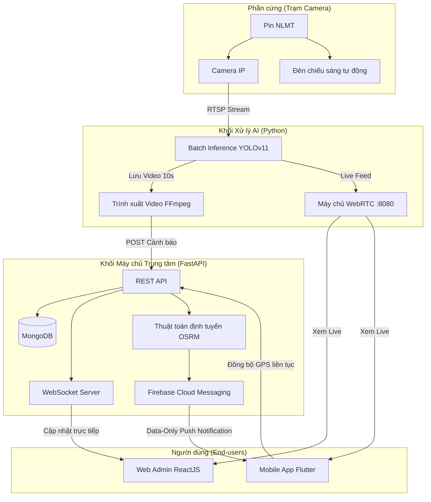
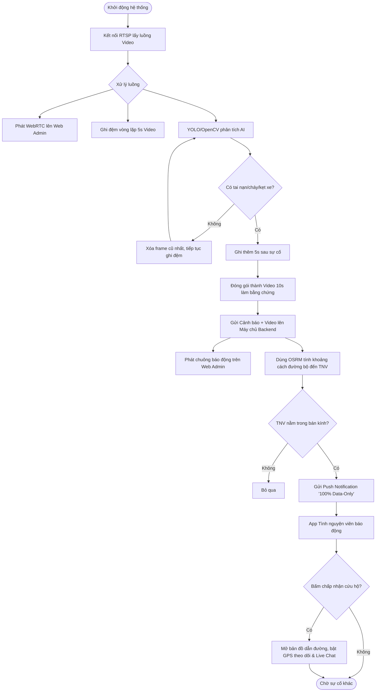

# THUYẾT MINH SẢN PHẨM SÁNG TẠO
*(Dự thi Tin học trẻ - Vòng khu vực)*

---

## ĐĂNG KÝ THÔNG TIN SẢN PHẨM DỰ THI
*[Điền thông tin theo mẫu của Ban tổ chức]*

## THÔNG TIN TÁC GIẢ (NHÓM TÁC GIẢ)
*[Điền thông tin cá nhân/nhóm của bạn]*

---
## GIỚI THIỆU VỀ SẢN PHẨM

### 1. Ý tưởng của sản phẩm
**Lý do lựa chọn nghiên cứu và phát triển sản phẩm**
Từ thực trạng gia tăng phương tiện, áp lực lên hạ tầng giao thông và nguy cơ tai nạn tại nhiều tuyến đường, đặc biệt ở các nút giao có tổ chức giao thông phức tạp, có thể thấy nhu cầu giám sát và cảnh báo sớm rủi ro là yêu cầu vô cùng thiết thực hiện nay. Tuy nhiên, tại các khu vực nông thôn và ngoại ô, công tác giám sát vẫn còn hạn chế do thiếu thiết bị, thiếu hạ tầng kết nối và phụ thuộc vào phương pháp thủ công, dẫn đến khả năng phát hiện tình huống nguy hiểm và phản ứng kịp thời chưa đáp ứng yêu cầu thực tiễn. Trong khi đó, các giải pháp giám sát thông minh tại đô thị lớn tuy đạt hiệu quả cao nhưng thường có chi phí đầu tư – vận hành lớn, yêu cầu hạ tầng đồng bộ và khó mở rộng.

Trong bối cảnh Cách mạng công nghiệp 4.0, trí tuệ nhân tạo và hệ thống nhúng mở ra hướng tiếp cận khả thi. Việc tích hợp camera và cảm biến trên nền tảng vi điều khiển cho phép thu thập dữ liệu trực tiếp tại hiện trường, xử lý nhanh nhằm nhận diện phương tiện, phát hiện hành vi hoặc tình huống có nguy cơ xảy ra tai nạn. Để tối ưu hóa nguồn lực xã hội, hệ thống còn kết nối trực tiếp với một ứng dụng di động dành cho các tình nguyện viên, tạo thành một mạng lưới phản ứng nhanh tại chỗ.
Với định hướng đó, nhóm quyết định lựa chọn và phát triển sản phẩm: **“Hệ thống giám sát thông minh, cảnh báo sự cố và điều phối cứu hộ giao thông”**.

**Ý nghĩa của sản phẩm**
Từ góc độ nghiên cứu STEM, sản phẩm sáng tạo dành cho học sinh, việc thiết kế một hệ thống nhúng giám sát, điều phối và cảnh báo kịp thời khi tai nạn giao thông xảy ra có ý nghĩa thiết thực. Hệ thống này hướng tới việc phát hiện sớm tai nạn, cảnh báo cho các phương tiện xung quanh, gửi thông tin đến lực lượng chức năng và **điều phối ngay các tình nguyện viên gần nhất** nhằm giảm thiểu hậu quả do tai nạn gây ra. Đồng thời, sản phẩm góp phần làm rõ khả năng ứng dụng hệ thống nhúng - AI - Cloud trong giải quyết các vấn đề xã hội.

**Mục tiêu sản phẩm**
- *Mục tiêu chung:* Phát triển hệ thống giám sát giao thông thông minh kết hợp ứng dụng di động, dùng camera AI để quan sát, phân tích tình hình giao thông nhằm hỗ trợ cơ quan chức năng, cung cấp bằng chứng và xây dựng hệ thống điều phối cứu hộ chi phí thấp, linh hoạt.
- *Mục tiêu cụ thể:*
  - Thiết kế và chế tạo mô hình giám sát giao thông hoạt động độc lập bằng năng lượng xanh tại các điểm đen giao thông.
  - Cung cấp bằng chứng hình ảnh/video xác thực (lưu vòng lặp 10 giây trước/sau sự cố) cho điều tra xử lý.
  - Phát triển ứng dụng di động (Mobile App) để tự động điều phối tình nguyện viên lân cận thông qua thuật toán định tuyến và định vị toàn cầu.

### 2. Giới thiệu tổng quan
**Thực trạng và khoảng trống hiện nay**
Tại Việt Nam, mặc dù số vụ tai nạn có xu hướng giảm, nhưng tỷ lệ tử vong và thương tật vẫn cao. Các biện pháp truyền thống như tuần tra, tuyên truyền tuy có hiệu quả nhất định nhưng còn hạn chế về quy mô, thời gian và chi phí. Hiện nay, các hệ thống camera AI chủ yếu giới hạn ở quy mô lớn, chi phí cao, tối ưu hóa lưu lượng phương tiện là chính. Các giải pháp giao thông thông minh trong nước chưa tích hợp được thiết bị hỗ trợ nhận diện khép kín (tai nạn, cháy, tụ tập đông người) kết nối trực tiếp với **người tham gia cứu hộ tại hiện trường**.

**Hướng tiếp cận của nhóm**
Trên cơ sở các khoảng trống đã xác định, nhóm lựa chọn hướng tiếp cận theo phương châm lấy tai nạn giao thông vào thời điểm ít phương tiện làm trung tâm. Cụ thể:
- Tăng cường khả năng tương tác giữa người dùng và hệ thống thông qua giao diện Web quản lý (Admin Dashboard) và Ứng dụng di động (Volunteer App).
- Ứng dụng công nghệ IoT, xử lý hình ảnh (Batch Inference YOLO) và kết nối thời gian thực (WebSocket, WebRTC) theo hướng tối ưu, đảm bảo hệ thống hoạt động ổn định 24/7, độ trễ thấp và có khả năng mở rộng.
- Tích hợp các thuật toán bản đồ số (OSRM) để tính toán chính xác lộ trình cầu viện, vượt qua các rào cản nền tảng di động để gửi thông báo tức thì (Push Notification).

---
## MÔ TẢ SẢN PHẨM

### 1. Chức năng chính của sản phẩm
**1.1. Mô tả rõ các tính năng của sản phẩm (Tính mới và Tính ưu việt)**
Sản phẩm là một hệ sinh thái khép kín gồm 4 chức năng cốt lõi:
- **Chức năng 1: Thiết kế chế tạo hệ thống giám sát thông minh phần cứng:**
  - Kết hợp camera giám sát và bộ xử lý hình ảnh theo thời gian thực hoạt động độc lập bằng năng lượng mặt trời.
  - Nhận diện tức thời đa sự cố (cháy, tai nạn, tụ tập đông người) với độ chính xác cao.
- **Chức năng 2: Đèn chiếu sáng ban đêm kết hợp nguồn lưu trữ:**
  - Nguồn pin lưu trữ cung cấp cho đèn chiếu sáng tự động và camera hoạt động liên tục lên đến 7 ngày không cần điện lưới.
- **Chức năng 3: Trang Web bản đồ giám sát (Admin Dashboard):**
  - Bản đồ hiển thị thiết bị giám sát. Khi có sự cố, thông báo tức thời nổ ra với âm thanh báo động.
  - Hỗ trợ công nghệ **WebRTC** xem Live camera với độ trễ siêu thấp.
  - Chức năng điều phối: Admin có thể bấm nút trực tiếp gọi các lực lượng 113, 114, 115.
- **Chức năng 4: Ứng dụng di động cho Tình nguyện viên (Volunteer App):**
  - Tình nguyện viên cài app sẽ nhận được Push Notification cảnh báo nếu sự cố nằm trong bán kính cho phép. 
  - Hiển thị bản đồ dẫn đường (thuật toán OSRM). Tích hợp phòng **Chat đa phương tiện** (gắn liền với mỗi sự kiện) để giao tiếp hai chiều với Admin và sẽ bị khóa (Read-only) khi sự cố kết thúc để làm bằng chứng.

**1.2. Mô tả nền tảng phát triển của sản phẩm**
**a. Đối với sản phẩm phần mềm**
- **Ngôn ngữ & Nền tảng:** Python (AI & FastAPI Backend), ReactJS (Web Admin), Flutter/Dart (Mobile App), MongoDB (Lưu trữ).
- **Sơ đồ kiến trúc tổng thể:**

- **Lưu đồ thuật toán và Mô tả hoạt động:**

**Giải thích lưu đồ thuật toán:**
1. Hệ thống khởi động, luồng Video (RTSP) được gửi về trung tâm.
2. Video được stream trực tiếp lên Web (qua WebRTC) và song song chạy OpenCV/YOLO để phân tích (Batch Inference).
3. **Bộ đệm lưu trữ vòng lặp:** Hệ thống luôn ghi đệm 5 giây video gần nhất. Nếu không có bất thường, xóa khung hình cũ nhất. Nếu có sự cố (tai nạn/cháy), tiếp tục ghi thêm 5 giây tạo thành video 10 giây nguyên vẹn cung cấp cái nhìn toàn cảnh trước và sau tai nạn.
4. Backend lưu CSDL, phát sóng (Broadcast) cảnh báo lên Web, đồng thời chạy thuật toán đường bộ OSRM tính khoảng cách đến các Tình nguyện viên và gửi Push Notification.
5. Tình nguyện viên nhận tin, bấm chấp nhận cứu hộ, GPS của họ liên tục đồng bộ lên Web để Admin theo dõi trực tiếp, đồng thời hai bên kết nối qua phòng Chat đa phương tiện.

**b. Đối với sản phẩm phần cứng**
- **Thành phần:** Mô hình được thiết kế theo trụ đèn giao thông thực tế gồm Tấm năng lượng mặt trời, Camera giám sát AI, Đèn chiếu sáng tự động, Khối pin lưu trữ, và Bộ xử lý.
- **Giải quyết vấn đề:** Giúp hệ thống thu thập hình ảnh liên tục 24/7 ở bất kỳ đâu, tự động thắp sáng vùng tối ban đêm để camera AI phân tích rõ hơn.

*[Chèn Hình ảnh mô hình phần cứng (Hình trụ đèn, tấm pin, camera giống như Version 1 vào khu vực này khi xuất file Word)]*

**1.3. Kết quả vận hành thử nghiệm và Thảo luận**
Hệ thống được đánh giá qua các tiêu chí định lượng và định tính cực kỳ khắt khe:
- **Độ chính xác phát hiện nguy cơ (%):**
  - Thử nghiệm trên 3 nhóm đối tượng (75 lượt đánh giá). Kết quả phát hiện đúng 73/75. **Độ chính xác trung bình: 97.3%**.
- **Thời gian phản hồi:** Trung bình 1,9 giây, nhanh nhất 1,3 giây.
- **Tính ổn định & Tối ưu hóa hệ thống:**
  - Quá trình thử nghiệm ghi hình 24/7 ban đầu gặp lỗi tràn RAM hệ thống (Memory Leak) do lưu lượng video lớn. Nhóm đã can thiệp kỹ thuật vào luồng dữ liệu của bộ mã hóa FFmpeg (định tuyến stdout/stderr), giúp hệ thống hoạt động ổn định 72 giờ liên tục mà không suy giảm tài nguyên. Tỷ lệ hoạt động ổn định đạt 97-98%.
- **Đánh giá trong điều kiện thời tiết (Nắng, Mưa, Sương mù, Ban đêm):**
  - Trời nắng đạt 100%. Trời mưa >90%. Sương mù 88%. Ban đêm 96% (nhờ kết hợp camera hồng ngoại và ánh sáng đèn LED tự động). Độ chính xác trung bình môi trường khắc nghiệt: 94%.

*[Chèn Bảng số liệu 1, 2, 3, 4, 5 từ Version 1 vào khu vực này khi xuất file Word]*

---
### 2. Đánh giá sản phẩm

**2.1. Tiềm năng ứng dụng**
- **Lắp đặt dễ dàng:** Tái sử dụng hạ tầng có sẵn (cột đèn). Không yêu cầu điện lưới.
- **Kết nối liên thông:** API chuẩn của Backend dễ dàng chia sẻ dữ liệu với mạng lưới Thành phố thông minh (Smart City), IOC, 113, 114, 115.

**2.2. Tính mới và Hiệu quả đem lại của sản phẩm**
- **Tính mới về AI và Dữ liệu:** Ứng dụng quy trình Auto-Labeling để xây dựng bộ dữ liệu. Kết hợp mô hình học sâu YOLO xử lý đa camera cùng lúc (Batch inference). Cài đặt các ngưỡng lọc (Threshold) chặt chẽ và thời gian hồi (Cooldown) để chống spam báo động giả.
- **Tính mới về phần mềm (Giải quyết bài toán di động và cảnh báo):** 
  - **Thuật toán "Bộ đệm lưu trữ vòng lặp":** Tự động đóng gói một video 10 giây cung cấp bằng chứng trước và sau tai nạn.
  - **Khắc phục triệt để Battery Saver trên điện thoại:** Các điện thoại Android thường chặn ứng dụng chạy ngầm. Nhóm đã sáng tạo thay đổi cấu trúc truyền tải của Firebase thành "100% Data-Only", ép hệ điều hành đánh thức ứng dụng Flutter để phát chuông báo động, đảm bảo tình nguyện viên luôn nhận được tin.
  - **Thuật toán định tuyến OSRM:** Thay vì dùng đường chim bay (Haversine) thiếu chính xác, hệ thống tính toán khoảng cách đường bộ thực tế để gọi tình nguyện viên, kết hợp cơ chế Cache 60s để chống sập API.
- **Hiệu quả Xã hội:** Thay đổi phương thức quản lý an toàn giao thông từ "thụ động chờ người dân báo tin" sang "chủ động phát hiện và điều phối cộng đồng tại chỗ", tận dụng tối đa thời gian vàng để cứu sống nạn nhân.

### 3. Yêu cầu đối với cơ sở hạ tầng cần thiết để triển khai
- Mạng Wi-Fi nội bộ ổn định.
- Ổ cắm điện 220V, bàn để đặt máy tính (Laptop/PC Server) và setup hệ thống mô hình phần cứng đèn/camera.

### 4. Sản phẩm được phát triển ước tính trong khoảng thời gian
- Số tháng: **6 tháng** (Từ tháng 12/2025 đến tháng 06/2026).

### 5. Hướng dẫn sử dụng sản phẩm
1. Khởi động kịch bản hệ thống (`start.bat`) tại máy chủ trung tâm.
2. Quản lý truy cập giao diện Web Admin để quan sát tổng quan bản đồ.
3. Tình nguyện viên cài đặt Ứng dụng di động (Android/iOS), đăng nhập và bật GPS.
4. Lắp đặt trạm camera tại khu vực cần giám sát (hoặc chạy video demo). Khi sự cố xảy ra, Web sẽ hú còi và điện thoại tình nguyện viên nhận được thông báo để bắt đầu cứu hộ và Live Chat.

### 6. Tự đánh giá về những mặt còn tồn tại chưa giải quyết được
- Tiếp tục gia tăng chiều rộng và chiều sâu của bộ dữ liệu AI để đối phó với điều kiện thời tiết cực đoan.
- Cần nghiên cứu phát triển khả năng xử lý tại biên (Edge AI) để giảm dung lượng truyền tải mạng 4G liên tục từ camera về trung tâm.

---
## KẾT LUẬN

### 1. Hướng phát triển của sản phẩm trong tương lai
1. **Nâng cấp thuật toán AI & Edge AI:** Triển khai mô hình AI trực tiếp trên các vi xử lý tại biên (như Jetson Nano) ngay tại cột đèn.
2. **Mở rộng tính năng:** Bổ sung nhận diện đi ngược chiều, không đội mũ bảo hiểm.
3. **Phát triển tính năng Gamification:** Xây dựng hệ thống điểm thưởng, xếp hạng huy chương cho tình nguyện viên nhằm xây dựng một cộng đồng năng nổ, bền vững.

### 2. Nguyện vọng trong tương lai
Dự án góp phần bổ sung cơ sở lý luận về việc kết hợp trí tuệ nhân tạo, thiết bị biên và nền tảng di động trong điều kiện đô thị Việt Nam. Nhóm kỳ vọng sản phẩm sẽ không chỉ nằm trên giấy mà được các cơ quan chức năng hỗ trợ khảo sát, thí điểm tại các điểm đen giao thông thực tế, góp phần xây dựng một xã hội an toàn và nhân ái hơn.

---
## TÀI LIỆU THAM KHẢO
1. J. Redmon, S. Divvala, R. Girshick, and A. Farhadi, “You Only Look Once: Unified, Real-Time Object Detection,” Proceedings of the IEEE CVPR, 2016.
2. Wikipedia contributors. Tai nạn giao thông đường bộ. Retrieved Dec 30, 2025.
3. Khanam, Rahima. "Yolov11: An overview of the key architectural enhancements." arXiv:2410.17725 (2024).
4. OpenCV documentation, “Introduction to OpenCV”.
5. R. Szeliski, Computer Vision: Algorithms and Applications, Springer, 2022.
6. Cisco Systems, Video Streaming over RTSP and IP Camera Systems, 2023.
7. NVIDIA Corporation, Edge AI for Smart Cities and Intelligent Video Analytics, 2023.
8. WHO, Global Status Report on Road Safety, 2023.
9. TEDI. (2016). An toàn giao thông đường bộ.
10. Tài liệu kiến trúc Flutter (https://flutter.dev) và FastAPI (https://fastapi.tiangolo.com).
*(Các tài liệu pháp luật, y học số 11-14 theo nguyên bản gốc)*

---
## CAM KẾT
Chúng tôi cam kết SPST dự thi chưa từng đạt giải tại các cuộc thi, hội thi cấp quốc gia hay quốc tế. Nếu sai phạm, chúng tôi xin chịu mọi hình thức xử lý theo quy định của Ban tổ chức.

Đà Nẵng, ngày 01 tháng 07 năm 2026  
**Chữ ký của tác giả/nhóm tác giả**  
*(Ký và ghi rõ họ tên)*
