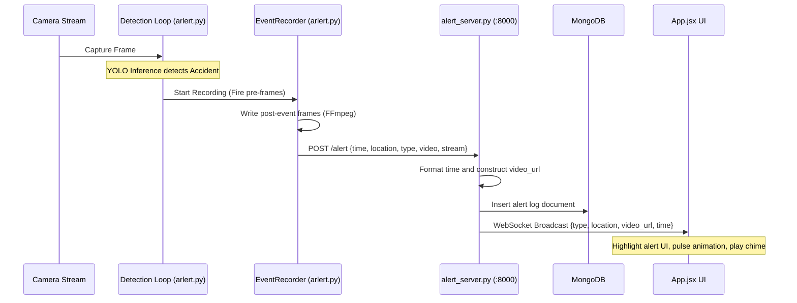
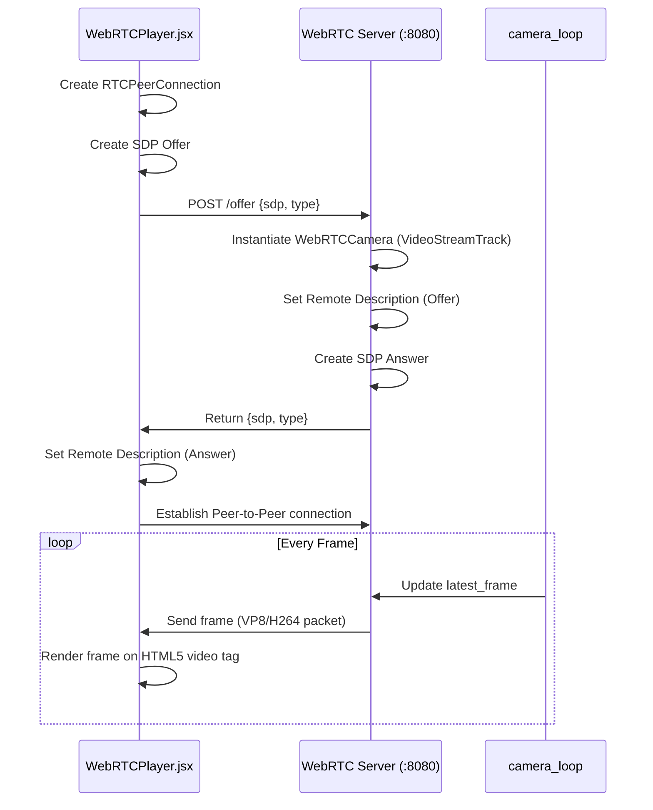

# Camera AI System Architecture Review

This document provides a comprehensive analysis of the existing Camera AI application, detailing its component architecture, codebase structure, data flow, and key integration points. It serves as a foundation for further development and extensions.

---

## 🏗️ System Architecture Overview

The system consists of five main components:
1. **ML Service (`ML/`)**: Frame capture, inference (accident, fire, congestion), WebRTC streaming server, and clip recording.
2. **Backend Service (`Arlert_BE/`)**: Alert logs storage, WebSockets server, API gateway, and Firebase Push Notifications.
3. **Frontend Web UI (`ai-cam-web/`)**: Real-time camera view via WebRTC, dynamic map tracking, volunteer management, and alert history.
4. **Flutter Mobile App (`flutter_app/`)**: Volunteer application that tracks live GPS location, handles Firebase Push Notifications, displays video playbacks of incidents, and supports dynamic incident force dispatch banners alongside a stateful, read-only capable interactive media chat.
5. **Cleanup Service**: Automatic pruning of 24/7 video recordings older than 24 hours.

```mermaid
graph TD
    subgraph Frontend [ai-cam-web React UI]
        UI[App.jsx]
        WebRTC[WebRTCPlayer.jsx]
        Map[MapView.jsx]
    end

    subgraph Backend [Arlert_BE FastAPI]
        BE[alert_server.py]
        DB[(MongoDB)]
        FCM[Firebase Admin SDK]
    end

    subgraph ML_Module [ML Python Service]
        Manager[CameraManager Batch Inference]
        Node1[CameraNode cam01 Capture Loop]
        Node2[CameraNode cam02 Capture Loop]
        RTC[WebRTC Server :8080]
        Rec[EventRecorder per Camera]
        ContRec[ContinuousRecorder per Camera]
    end

    subgraph Mobile [Flutter App]
        FlutterApp[Volunteer Mobile App]
    end

    subgraph Storage [Local Storage]
        AlertsFolder[(/alerts)]
        ContFolder[(/continuous_recordings)]
    end

    %% Video Capture and Processing
    Node1 -->|Frame Buffer| Manager
    Node2 -->|Frame Buffer| Manager
    Node1 -->|Stream Frames| RTC
    Node2 -->|Stream Frames| RTC
    Manager -->|Trigger Event| Rec
    Manager -->|Continuous Push| ContRec

    %% Recording & Storage
    Rec -->|Save Clip| AlertsFolder
    ContRec -->|Save Clip| ContFolder

    %% Communication Flows
    Rec -->|POST /alert| BE
    BE -->|Insert| DB
    BE -->|WebSocket Broadcast| UI
    BE -->|Haversine Distance Filter & Send FCM| FCM
    FCM -.->|Push Notification| FlutterApp
    UI -->|Render Alert list| UI
    UI -->|Request Offer| WebRTC
    WebRTC -->|SDP Handshake /offer/{cam_id}| RTC
    RTC -.->|WebRTC Stream| WebRTC
    
    %% Flutter App Communication
    FlutterApp -->|POST /api/location| BE
    FlutterApp -->|POST /api/register| BE
    FlutterApp -->|GET /videos/| BE

    %% Manual Trigger Flow
    UI -->|POST /trigger/type| BE
    BE -->|POST /manual_trigger| RTC
    RTC -->|Queue Trigger| YOLO
```

---

## 📁 Codebase Directory Structure

* **`start.bat`**: Startup script that launches all services in separate command prompts.
* **`ML/`**: Contains the machine learning, video processing, and local WebRTC streaming scripts.
  * [arlert.py](file:///d:/cameraAI2/ML/arlert.py): The core script running OpenCV capture, YOLOv8 models (`ver3.pt`, `fire.pt`, `person.pt`), WebRTC offer handling (`aiortc`), and file recording.
  * [cleanup_old_videos.py](file:///d:/cameraAI2/ML/cleanup_old_videos.py): Script scheduled or run in a loop to remove video segments older than 24 hours.
* **`Arlert_BE/`**: Contains the FastAPI alert server backend.
  * [alert_server.py](file:///d:/cameraAI2/Arlert_BE/alert_server.py): FastAPI app implementing REST endpoints, static video serving, and WebSocket alerts broadcaster.
  * [db.py](file:///d:/cameraAI2/Arlert_BE/db.py): Initializes MongoDB connection via the async `motor` driver.
* **`ai-cam-web/`**: Vite-based React frontend app leveraging a native Ant Design layout enhanced with a custom manual drag-resizer for fluid workspaces, and `dayjs` for historical alert filtering.
  * [src/App.jsx](file:///d:/cameraAI2/ai-cam-web/src/App.jsx): Main dashboard page. Wraps the sidebar, map, and camera in an interactive resizable layout powered by custom React mouse event handlers. Includes a DatePicker filter for alerts.
  * [src/components/WebRTCPlayer.jsx](file:///d:/cameraAI2/ai-cam-web/src/components/WebRTCPlayer.jsx): Simple WebRTC player establishing peer connections with the ML service. Includes connection retry logic for stream dropouts.
  * [src/components/MapView.jsx](file:///d:/cameraAI2/ai-cam-web/src/components/MapView.jsx): Google Maps view showing camera coordinates and details. Includes manual trigger buttons for rapid alert testing.
  * [src/components/FocusPanel.jsx](file:///d:/cameraAI2/ai-cam-web/src/components/FocusPanel.jsx): A highly interactive "Theo dõi" (Focus View) dashboard. Opens a full-screen split view containing the live WebRTC camera feed and a dedicated Google Map that polls `GET /api/alerts/{id}/tracking` every 3 seconds to plot live volunteer GPS coordinates and status ("Tham gia cứu hộ").
  * [src/components/AlertStats.jsx](file:///d:/cameraAI2/ai-cam-web/src/components/AlertStats.jsx): Modal component using `recharts` to display visual analytics (Pie & Bar charts) of alerts, dynamically filterable by Date and Camera. Includes metrics like "Resolved Alerts".
  * [src/hooks/useAlerts.js](file:///d:/cameraAI2/ai-cam-web/src/hooks/useAlerts.js): Fetches full alert history and handles WebSocket connections with auto-reconnect loops to sync `new`, `update`, and `volunteer_added` payloads.
  * [src/hooks/useAlertSound.js](file:///d:/cameraAI2/ai-cam-web/src/hooks/useAlertSound.js): Auto-unlocks audio context and plays warning sounds *only* when a strictly new alert (validated by `_id` and `time` normalization) arrives.
* **`flutter_app/`**: The volunteer mobile application built with Flutter.
  * **Network Handling (`api_service.dart`)**: The app relies on a dynamic `baseUrl`. Connects directly to localhost `10.0.2.2:8000` on Emulators to bypass ngrok issues, and uses a static ngrok domain for physical devices.
  * **Authentication (`shared_preferences`)**: Users are persisted locally via `shared_preferences`. The app checks `loadUserId()` on boot and completely bypasses the login screen for returning users. Phone numbers are securely mapped and utilized as unique IDs.
  * **Video Playback & Live Stream**: The mobile app dynamically loads `.mp4` files hosted from FastAPI via a `video_player` plugin, and handles delayed video processing via an automatic 5-second polling loop. Additionally, it embeds a local WebRTC component to view the live camera stream actively during missions.
  * **Location Sync**: Periodically syncs user's real-time GPS coordinates via `Geolocator` to the FastAPI backend `POST /api/location`.
  * **Strict Distance Routing**: Completely deprecated Haversine straight-line algorithms locally. The app strictly enforces OSRM real-road distances to determine if a dispatched volunteer is within their `preferredRadius`, safely dropping unreachably far alerts.
  * **Background Notifications & WebSockets**: Uses a strict `100% Data-Only` FCM payload (`is_data_notification`). This architecture is critical to bypass aggressive Battery-Saver kills on Custom Android ROMs (Xiaomi/Oppo/Samsung) which silently drop standard `notification` payloads. The Flutter app uses a background isolate and `flutter_local_notifications` to manually construct and fire the system tray notifications, guaranteeing delivery.
  * **Profiles & Missions**: Users manage 'Skills' and 'Alert Preferences' which are stored in MongoDB. The Mission Screen presents dispatched volunteers via a Draggable Scrollable Bottom Sheet to ensure the map remains fully visible. Allows manual map reloading by double-tapping the bottom navigation bar.

---

## 🔍 Module Breakdowns & Details

### 1. ML & Detection Service (`ML/`)
This module is structured around a central manager and dynamic nodes:
* **CameraNode (`capture_loop` thread)**: Each camera runs its own thread that captures frames at high speed from `cv2.VideoCapture` and maintains a thread-safe `latest_frame` buffer.
* **CameraManager (`inference_loop` thread)**:
  * Performs batch inference across all active `CameraNode` buffers simultaneously targeting **5 FPS**.
  * Runs three model pipelines:
    1. Accident detection: `model_accident` (`ver3.pt`, class `0` represent accidents).
    2. Fire detection: `model_fire` (`fire.pt`) or `model_accident` (class `1` represent fires).
    3. Vehicle tracking: `model_vehicle` (`person.pt` using YOLO `.track` on classes `[2, 3, 5, 7]` (cars, motorcycles, buses, trucks)).
  * Alert Logic:
    * **Fire & Accident**: Requires matching frames $\ge 3$ consecutive frames (`ALERT_FRAME_THRESHOLD`) + Cooldown checks.
    * **Congestion**: Requires $\ge 7$ vehicles (`VEHICLE_COUNT_THRESHOLD`) where at least one vehicle has been tracked as stationary for $\ge 10$ seconds (`VEHICLE_STATIONARY_TIME`).
  * **Video Recording**:
    * Uses an `EventRecorder` with `deque` buffers.
    * When triggered (automatically or manually), it captures `PRE_EVENT_SEC` (5s) from history and writes another `POST_EVENT_SEC` (5s).
    * Subprocess pipelines the raw frames into an `ffmpeg` writer utilizing NVIDIA GPU acceleration (`-c:v h264_nvenc`) to output standard `.mp4` video files to the `/alerts` folder. The subprocess strictly routes `stdout` and `stderr` to `DEVNULL` to prevent OS pipe buffer deadlocks which previously caused catastrophic out-of-memory (`_ArrayMemoryError`) leaks.
    * Posts the metadata to the backend endpoint `/alert`.
* **24/7 Continuous Recording (`ContinuousRecorder`)**:
  * Records consecutive 5-second video clips (`CONTINUOUS_CLIP_DURATION = 5`).
  * Saves clips organized by day/hour folders: `../continuous_recordings/YYYY-MM-DD/HH/`.
* **HTTP & WebRTC Server (`aiohttp` on port 8080)**:
  * Serves `/offer/{cam_id}` POST requests to coordinate the WebRTC SDP handshake, mapping a custom `VideoStreamTrack` subclass `WebRTCCamera` to feed the `latest_frame` of the requested camera.
  * Exposes `/mjpeg/{cam_id}` GET endpoint that serves a native `multipart/x-mixed-replace` JPEG stream. This acts as a highly robust zero-latency fallback for mobile clients.
  * Serves `/manual_trigger/{cam_id}` POST requests to enqueue manual alerts from the backend.

### 2. Backend API Service (`Arlert_BE/`)
Built with **FastAPI** on port 8000:
* **Storage**: Integrates with MongoDB database `ai_camera` and collection `alerts` and `users_col`.
* **WebSocket Alerts**: Maintained at `/ws/alerts` for real-time client updates. When a new alert is received from the ML script, it broadcasts a JSON payload to all connected clients.
* **Firebase Push Notifications**: On `POST /alert`, the backend iterates over registered users and evaluates their distance to the camera using the open-source OSRM routing API. It employs a 60-second in-memory coordinate cache to bypass rate-limiting, falling back to Haversine straight-line distance if OSRM is unavailable. If the distance is $\le$ the user's specific `radius` and their preferences match the alert type, it pushes a 100% data-only FCM payload using the `firebase-admin` Python SDK. The dispatch loop is wrapped in per-user `try/except` blocks to ensure a single dead token doesn't crash the entire broadcast.
* **Video Server**: Mounts the `/alerts` folder as static files under `/videos/` to stream alert clips back to the frontend and Flutter app.
* **Media Chat Server**: Exposes `/api/alerts/{id}/chat` and `/api/alerts/{id}/chat/media` for uploading images and audio messages. Media is saved to a static `/chat_media` directory and broadcasted live to the dashboard and mobile app.
* **Manual Triggers**: Exposes `/trigger/fire`, `/trigger/accident`, and `/trigger/congestion` endpoints which proxy calls to `http://localhost:8080/manual_trigger`.

### 3. Frontend Web Interface (`ai-cam-web/`)
A dashboard leveraging Ant Design components:
* **WebRTC Live Stream**: Renders direct video stream. On startup, performs SDP exchange with port 8080.
* **Map Tracking**: Integrates with Google Maps. Renders coordinates for active cameras. Selecting a camera changes the active video stream URL.
* **Real-time Alert Bar**: Subscribes to the WebSocket. Incoming alerts flash on-screen, trigger a pulsing badge, and play a warning audio chime (`/alert.mp3`).
* **Focus Panel (Chế độ theo dõi/xem lại)**: Clicking an alert opens a unified panel that retrieves the corresponding recorded clip from backend static files (`http://localhost:8000/videos/...`) if closed, or the live WebRTC stream if open. It also contains the read-only or active media chat and volunteer tracking map.

---

## 🔄 Core Sequences & Data Flow

### A. Alert Detection & Dispatch Flow


### B. Live Stream Handshake (WebRTC)


---

## 🚀 Recommended Roadmap for Development & Extensions

### Phase 1: Robustness & Error Handling (High Priority)
* **Reconnection Logic**: The WebRTC stream handles dropouts gracefully via `App.jsx`, but further optimizations to peer connection rebuilding could be made for low-bandwidth cellular environments.
* **React WebSocket Memory Leak (COMPLETED)**: Ghost socket connections resulting from React Strict Mode mounts were purged using aggressive teardown states in `useAlerts.js`.
* **Flutter State Corruption (COMPLETED)**: Fixed a structural bug where synchronous mutation of `ValueNotifier` instances broke notification chains for rapid consecutive push alerts. We safely deferred execution loops inside `map_screen.dart`.
* **Flutter Boot Initialization & Race Conditions (COMPLETED)**: Refactored `MapScreen` to completely run async initialization tasks (GPS, API polling) in parallel without blocking the WebSocket connection. Added `getNotificationAppLaunchDetails` to capture terminated-state notifications. Restored `ModalRoute` animation tracking to prevent bottom sheets from rendering into unmounted widget contexts during page transitions.
* **Multi-Camera Architecture (COMPLETED)**:
  * The system now fully supports an unlimited number of cameras via dynamic `CameraNode` mounting and batch inference.
  * Admins can configure cameras via the React web UI.

### Phase 2: AI & Analytics Improvements
* **Visual Bounding Boxes**:
  * Currently, the WebRTC stream and the saved video clips contain raw unannotated frames.
  * **Option A**: Draw bounding boxes, tracks, and confidence labels directly onto frames before pushing them to `WebRTCCamera` and `EventRecorder`.
  * **Option B** (Recommended for performance): Send coordinates as metadata over WebRTC Data Channels and render bounding boxes on the frontend client (reduces server-side CPU/GPU load).
* **Model Optimization**:
  * Use TensorRT or OpenVINO to run inference on the YOLO models for faster performance and lower latency.
  * Standardize classes and models. Combine models if possible (e.g. standard YOLO model with custom classes for accident/fire) to save GPU memory.

### Phase 3: Infrastructure & Backend Scaling
* **Docker Containerization**:
  * Dockerize the Backend and MongoDB.
  * Build a CUDA-enabled Docker image for the ML service containing OpenCV, PyTorch, YOLO, and FFmpeg with NVENC support.
* **Storage Policy**:
  * The current cleaning script `cleanup_old_videos.py` runs locally on a timer. Integrate the cleaning service directly into the backend or run it as a lightweight Cron service.
  * Implement automated backup of alert clips to Cloud Storage.

---

## 🛠️ Developer Checklist for Next Task
When the user asks to implement a new feature:
1. Ensure MongoDB is running on `localhost:27017` before launching backend.
2. Verify PyTorch GPU support (`torch.cuda.is_available()`) on the machine running the camera script.
3. Make sure NVENC graphics drivers are installed; if FFmpeg fails due to encoding drivers, fall back to cpu encoding (`libx264` instead of `h264_nvenc` in `arlert.py`).
